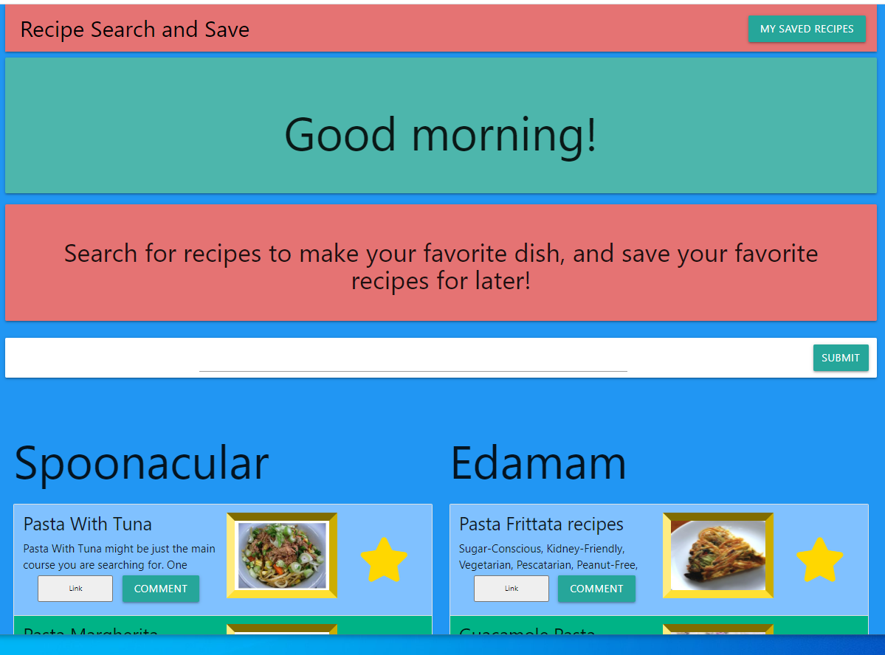

# updated-portfolio:
 /img"> 

# Project-1

This project uses Spoonacular and Edmam APIs to make a very practical web-page. The favorite recipies are searched and then saved with comments in the localStorage for future use.

Link to Github repository files: https://github.com/the64man1/Gooberville-Foods/

Link to Github pages website: https://the64man1.github.io/Gooberville-Foods/

 /img"> 
There were five hardworking contributors for this page; there names are as follow:

1. Cristobal Canales
2. Max Quintanilla
3. Katherine Seeburger
4. Luis Cuevas
5. Syed S. Rizvi

# Password Generator:

this random password generator is based on JavaScript and uses lower & upper case letters, numberes and special characters to generate a password between 8 to 15 characters long.

Link to Github Repo: https://github.com/rizvi5a/PasswordGen

Link to web page: https://rizvi5a.github.io/PasswordGen/

/img"> 

# Code Quiz:

This quiz is based on testing user's basic JavaScript knowledge. The user is allowed to select correct answer within fifteen seconds from a menu of four multiple choice answers. 

Link to Github Repo: https://github.com/rizvi5a/Quiz

Link to web page: https://rizvi5a.github.io/Quiz

/img">